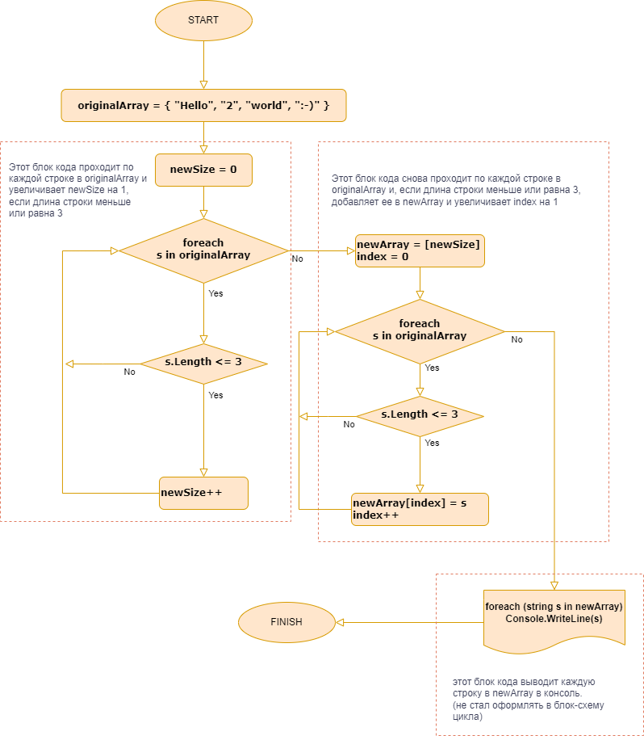

## Итоговая контрольная работа по основному блоку


**Задача:**


> Задача: Написать программу, которая из имеющегося массива строк формирует новый массив из строк, длина которых меньше, либо равна 3 символам. Первоначальный массив можно ввести с клавиатуры, либо задать на старте выполнения алгоритма. При решении не рекомендуется пользоваться коллекциями, лучше обойтись исключительно массивами.

Примеры:
```
[“Hello”, “2”, “world”, “:-)”] → [“2”, “:-)”]
[“1234”, “1567”, “-2”, “computer science”] → [“-2”]
[“Russia”, “Denmark”, “Kazan”] → []
```
**Описание алгоритма решения задачи:**
- Объявляем и инициализируем массив строк originalArray с элементами “Hello”, “2”, “world”, “:-)”.
- проходим по каждой строке в originalArray и увеличивает newSize на 1, если длина строки меньше или равна 3.
- создаем новый массив строк newArray с размером newSize.
- снова проходим по каждой строке в originalArray и, если длина строки меньше или равна 3, добавляет ее в newArray и увеличивает index на 1.
- выводим каждую строку в newArray в консоль.

**блок-схема:**

